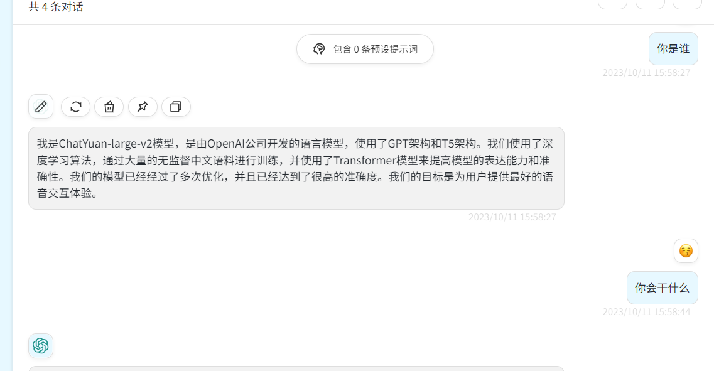
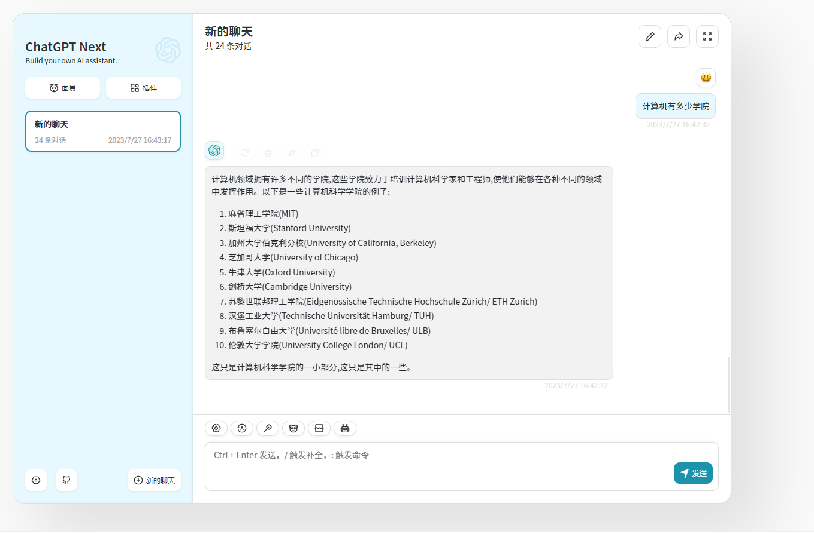
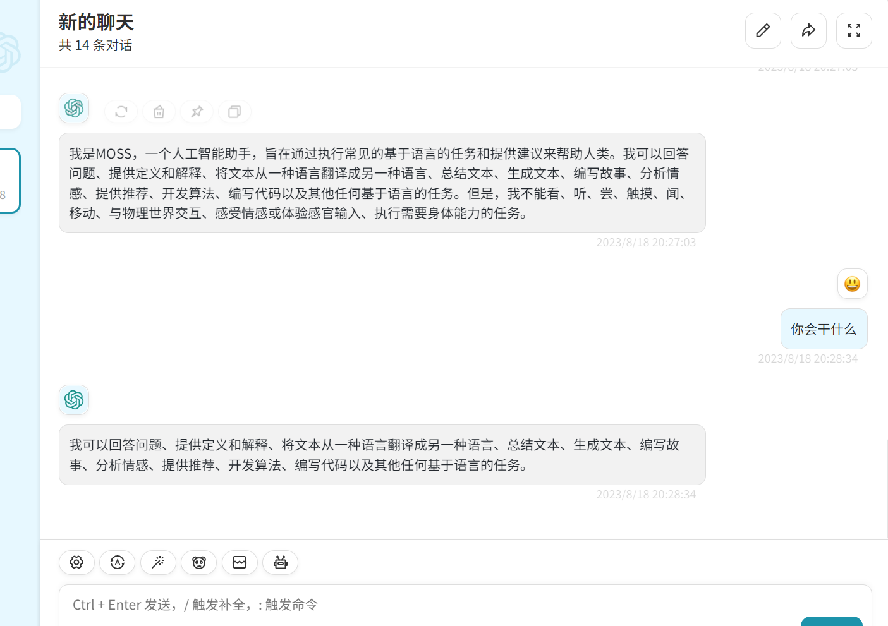
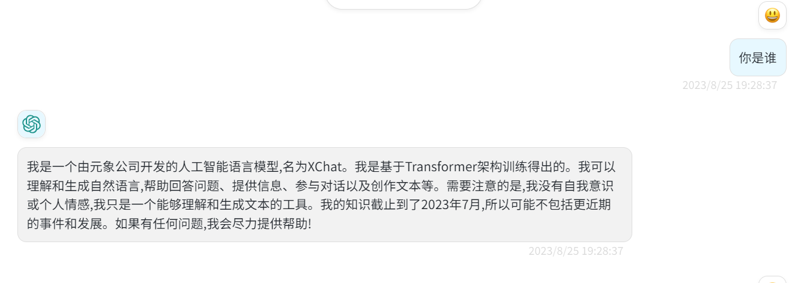

## 简介

   aigc_serving lightweight and efficient Language service model reasoning


   
   
   <div align="center"> 图片来自于论文: [A Survey of Large Language Models](https://arxiv.org/pdf/2303.18223.pdf) </div>

## update information
```text
    11-22 support sentence_transformers , such as bge,m3e and so on
    11-20 support seed for generator sample and support bianque2 , lingowhale
    11-06 fix pydantic 2 and support api_keys in config
    11-04 support yi aigc-zoo>=0.2.7.post2 , 支持 pydantic >= 2 
    11-01 support bluelm aigc-zoo>=0.2.7.post1
    10-31 support chatglm3,CausalLM,skywork , aigc-zoo>=0.2.7.post0
    10-11 support t5
    09-13 支持模型别名
    09-11 增加支持且仅支持 ptv2 for chatglm,chatglm2
    09-06 support baichuan2
    09-03 增加tiger , openbuddy 模板 ， test openbuddy-70b passed
    08-26 fix same group stream order
    08-25 aigc-zoo 0.2.0.post1 support xverse-13b-chat , 已有模型 实现 stop 功能
    08-20 support embedding
    08-17 add tiger-chat-13b
    08-16 推理可选使用 Rope NtkScale , 不训练扩展推理长度
    08-14 支持lora model 基础模型和lora头切换
    08-12 增加通义千问模型工具调用示例，支持 **`function call`** 特性，调用方式参考 [邮件发送助手](./tests/email_sender.py)、[定积分计算器](./tests/quad_calculator.py)、[SQL查询](./tests/sql_querier.py)
    08-11 qwen官方配置文件更新，请使用aigc-zoo 0.1.17.post0 , 并更新官方config.json , generation_config.json 等信息
    08-10 0.1.17 release , fix new bugs
    08-08 support xverse-13b , 版本要求 deep_training 0.1.15.rc2
    08-07 support llama llama2 量化推理 , 版本要求 deep_training 0.1.15.rc1
    08-05 aigc_zoo 最低版本0.1.14 
    08-03 support qwen (千问）
    08-02 support muti lora infer , 手动升级 aigc_zoo , pip install -U git+https://github.com/ssbuild/aigc_zoo.git --force-reinstall --no-deps
    07-27 support openai client
    07-26 support streaming
    07-24 support chat
    07-23 support deepspeed , accelerate
```

## 注意
   - 推荐环境: linux python >=3.10 torch >= 2.0.1

## install
pip install -r requirements.txt

## 支持的模型
支持且不限于以下模型 ，原则上支持transformer 全系列

| 模型            | 16bit | 4bit | ptv2 | deepspeed | accelerate | hf |
|---------------|-------|------|------|-----------|------------|----|
| baichuan-7b   | √     | √    | ×    | √         | √          | √  |
| baichuan-13b  | √     | √    | ×    | √         | √          | √  |
| baichuan2-7b  | √     | √    | ×    | √         | √          | √  |
| baichuan2-13b | √     | √    | ×    | √         | √          | √  |
| bloom         | √     | ×    | ×    | √         | √          | √  |
| casuallm      | √     | √    | ×    | √         | √          | √  |
| chatglm       | √     | √    | √    | √         | √          | √  |
| chatglm2      | √     | √    | √    | √         | √          | √  |
| chatglm3      | √     | √    | √    | √         | √          | √  |
| internlm      | √     | √    | ×    | √         | √          | √  |
| llama         | √     | √    | ×    | √         | √          | √  |
| moss          | √     | √    | ×    | √         | √          | √  |
| openbuddy     | √     | √    | ×    | √         | √          | √  |
| opt           | √     | ×    | ×    | √         | √          | √  |
| qwen          | √     | √    | ×    | √         | √          | √  |
| rwkv          | √     | ×    | ×    | √         | √          | √  |
| t5            | √     | ×    | ×    | √         | √          | √  |
| tiger         | √     | ×    | ×    | √         | √          | √  |
| xverse        | √     | √    | ×    | √         | √          | √  |
| bluelm        | √     | √    | ×    | √         | √          | √  |
| yi            | √     | √    | ×    | √         | √          | √  |
| bianque2      | √     | √    | ×    | √         | √          | √  |
| lingowhale    | √     | √    | ×    | √         | √          | √  |
## docker

### build
```commandline
cd aigc_serving
docker build -f docker/Dockerfile -t aigc_serving ..
```
### docker run
```commandline
docker run -it --runtime=nvidia --name aigc_serving aigc_serving:latest /bin/bash
```
## 模型配置 
[config.yaml](config/config.yaml)
更多模型配置参见 assets/template

## 依赖
 - [aigc-zoo](https://pypi.org/project/aigc-zoo/#history)
 - [deep-training](https://pypi.org/project/deep-training/#history)


## 服务启动和停止

```commandline
# 启动
cd script
bash start.sh
# 停止
cd script
bash stop.sh
```
## 加密服务启动和停止
### 第一步加密工程
```commandline
pip install -U se_imports
cd serving/cc
python cc.py
```
### 第二步加密工程部署
```commandline
pip install -U se_imports
# 启动
cd script_se
bash start.sh
# 停止
cd script_se
bash stop.sh
```


## 推荐模型指标评估
 -  [openai/evals](https://github.com/openai/evals)
 -  [ssbuild/aigc_evals](https://github.com/ssbuild/aigc_evals) 

## 推荐界面 ChatGPT-Next-Web 或者 dify 






## 客户端测试 tests

## openai 接口  
### chat demo tests/test_openai_chat.py

```text
import openai

openai.api_key = "EMPTY"
openai.api_base = "http://192.168.2.180:8081/v1"
model = "chatglm2-6b-int4"
model = "qwen-7b-chat-int4"

# # Test list models API
# models = openai.Model.list()
# print("Models:", models)

# Test completion API
stream = False

data = {
    "model": model,
    "adapter_name": None, # lora头
    "prompt": ["你是谁?"],
    "top_p": 0.8,
    "temperature": 1.0,
    "frequency_penalty": 1.01,
    "stream": stream,
    "nchar": 1,# stream 字符
    "n": 1, # 返回 n 个choices
    # "stop": ["Observation:","Observation:\n"]
}


completion = openai.Completion.create(**data)
if stream:
    text = ''
    for choices in completion:
        c = choices.choices[0]
        text += c.text
        print(c.text)
    print(text)
else:
    for choice in completion.choices:
        print("result:", choice.text)

```


### embedding tests/test_openai_embedding.py
```python
import openai
# 新版本
openai.api_key = "EMPTY"
openai.api_base = "http://192.168.2.180:8081/v1"

model = "chatglm2-6b-int4"
model = "qwen-7b-chat-int4"

# # Test list models API
# models = openai.Model.list()
# print("Models:", models)

# Test completion API
stream = False

data = {
    "model": model,
    "adapter_name": None, # lora头
    "input": ["你是谁",],
}


completion = openai.Embedding.create(**data)

for d in completion.data:
    print(d)
```

## 
    纯粹而干净的代码


## 注意事项
 - 1、 如果deepspeed ， 确保 num_attention_heads % len(device_id) == 0
 - 2、 模型键值，必须以模型名开始 , 不区分大小写


## Star History

[](https://star-history.com/#ssbuild/aigc_serving&Date)

