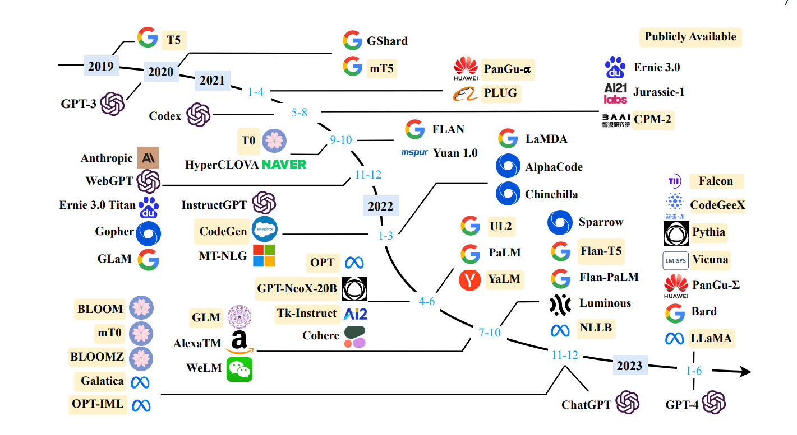

## 简介

   localserving lightweight and efficient Language service model reasoning


   
   
   <div align="center"> 图片来自于论文: [A Survey of Large Language Models](https://arxiv.org/pdf/2303.18223.pdf) </div>

## update information
```text
    08-14 支持lora model 基础模型和lora头切换
    08-12 增加通义千问模型工具调用示例，支持 **`function call`** 特性，调用方式参考 [邮件发送助手](./tests/email_sender.py)、[定积分计算器](./tests/quad_calculator.py)、[SQL查询](./tests/sql_querier.py)
    08-11 qwen官方配置文件更新，请使用aigc-zoo 0.1.17.post0 , 并更新官方config.json , generation_config.json 等信息
    08-10 0.1.17 release , fix new bugs
    08-08 support xverse-13b , 版本要求 deep_training 0.1.15.rc2
    08-07 support llama llama2 量化推理 , 版本要求 deep_training 0.1.15.rc1
    08-05 aigc_zoo 最低版本0.1.14 
    08-03 support qwen (千问）
    08-02 support muti lora infer , 手动升级 aigc_zoo , pip install -U git+https://github.com/ssbuild/aigc_zoo.git --force-reinstall --no-deps
    07-27 support openai client
    07-26 support streaming
    07-24 support chat
    07-23 support deepspeed , accelerate
```
   推荐环境:
   linux python >=3.8 torch >= 2.0.1
    

## install
pip install -r requirements.txt


## 最新的安装包
 - [aigc-zoo](https://pypi.org/project/aigc-zoo/#history)
 - [deep-training](https://pypi.org/project/deep-training/#history)

```text
 安装顺序 
 先安装 aigc-zoo
 再安装 deep-training
```


## 启动
修改 config/main.py 配置文件

```commandline
cd script
bash start.sh
```

##  停止
```commandline
cd script
bash stop.sh
```


## openai 接口  demo tests/openai_client.py

```text
Models: {
  "data": [
    {
      "created": 1690434104,
      "id": "bloom-560m",
      "object": "model",
      "owned_by": "localserving",
      "parent": null,
      "permission": [
        {
          "allow_create_engine": false,
          "allow_fine_tuning": false,
          "allow_logprobs": true,
          "allow_sampling": true,
          "allow_search_indices": true,
          "allow_view": true,
          "created": 1690434104,
          "group": null,
          "id": "modelperm-fd413444-e293-4500-a4f6-653c773f17f8",
          "is_blocking": false,
          "object": "model_permission",
          "organization": "*"
        }
      ],
      "root": "bloom-560m"
    }
  ],
  "object": "list"
}
Completion result: ？我的父亲。我曾以为我是一个很坚强的女孩,但是当我遇到这个男孩的时候我才发现原来我没有那么的坚强！曾经我们相恋了三个月的时间,他却让我失去了理智并且对我很冷淡.一次又一次地伤害了我！我开始怀疑自己的感情是不是真的能够长久的存在下去！于是我在网上看到了这样一篇文章:其实爱情是很容易变质的！也许是你喜欢上了别人才变的爱你；也可能是你因为爱而爱上另一个人才会把你放弃；而或许是你不懂珍惜一个人就已经不在乎了！</s>

```


## 推荐界面 ChatGPT-Next-Web


## 
    纯粹而干净的代码


## 注意事项
```text
1、 如果deepspeed ， 确保 num_attention_heads % len(device_id) == 0

```


## Star History

[](https://star-history.com/#ssbuild/localserving&Date)

